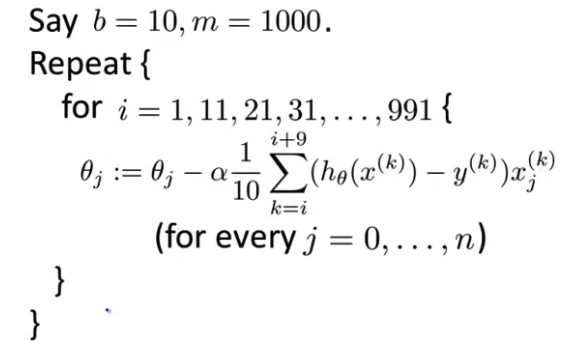

# Week 10

## Learning with Large Datasets

在用 Large Datasets 之前，可以用一个小一点的 m 个样本先试试，

然后画学习曲线，如果 $J_{train}(\theta)$ 和 $J_{cv}(\theta)$ 之间的空间较大，说明方差大，则可以通过增大 m 来改善，如果已经很接近了，说明偏差大，增大 m 无意义，则可通过加多项式或加hidden layer（NN）等方式改善方差，从而得到偏差大的结果，再尝试增大 m 。

以下以线性回归为例。

## Stochastic Gradient Descent 随机梯度下降

Large Datasets 数目太大时，梯度下降的计算量太大。

以前常规的梯度下降也叫做 Batch gradient decent

BGD 的做法是，一个大循环中，每次计算一个 $\theta$ 的step时，都要引入全部训练数据来计算 $\alpha\frac{1}{m}\sum\limits_{i=1}\limits^m(h_\theta(x^{(i)})-y^{(i)})x_j^{(i)}$ ，所以非常耗费计算资源。

而 SGD 的做法是：

1. 随机打乱数据集；

2. 在一个大循环中，执行一个遍历数据集的小循环，在小循环中，针对每一个训练数据 $x^{(i)}$ 来 计算$\theta_j (for j=0,...,n)$ 的下降量。

   公式为：
   $$
   cost(\theta,(x^{(i)},y^{(i)})) = \frac{1}{2}(h_\theta(x^{(i)})-y^{(i)})^2 \\
   J_{train}(\theta) = \frac{1}{m}\sum\limits_{i=1}\limits^mcost(\theta,(x^{(i)},y^{(i)})) \\
   Repeat \{ \\
   for\  i =1,...,m \{ \\
   \theta_j:=\theta_j-\alpha(h_\theta(x^{(i)})-y^{(i)})x^{(i)}_j \\
   
   \}\\\}
   $$

因为 SGD 根据每个数据进行 $\theta$ 下降计算，所以下降曲线不会像 BGD 那样平滑地指向最低点，而是呈现一种在整体方向上趋近最低点，但在局部区域内是随机轨迹，并且最后不会像BGD那样收敛于最低点并保持，而是在最低点一个范围区域内随机运动（$\alpha$ 小，则震荡范围小）。

关于 $\alpha$ 的取值，可以越来越小，例如：$\alpha = \frac{constant1}{no.iterates + constant2}$，也可以保持不变。

外层大循环通常1次就够，一般不超过10次。

## Mini-Batch Gradient Descent 小批量梯度下降

介于 SGD 和 BGD 之间，mBGD 在小循环时每次取出 $b$ 个数据，计算 $b$ 个训练数据下的下降量，而不是只计算一个。$b=mini-batch\ size$

即，$\theta_j:=\theta_j-\alpha\frac{1}{b}\sum\limits_{k=i}\limits^{i+b-1}(h_\theta(x^{(k)})-y^{(k)})x^{(i)}_j \\$，然后 $i= i+b$

> 小批量梯度下降和随机梯度下降与批量梯度下降之间的比较，就好像，批量梯度下降是先仔细计划，再执行；而另外两种方法都像是先执行，再调整，所以执行速度较快。

矢量化做得好的话，mBGD 可比另外两种方法执行的都快。

## SGD Convergence 随机梯度下降收敛

如何确保 SGD 收敛

$cost(\theta,(x^{(i)},y^{(i)})) = \frac{1}{2}(h_\theta(x^{(i)})-y^{(i)})^2$

梯度下降过程中，每次更新 $\theta$ 之前，计算 $cost(\theta,(x^{(i)},y^{(i)}))$ 。然后，每1000个样本，计算一下 cost 的平均值，将这些平均值 plot 出来，看是否收敛。样本数越大，plot 出来的曲线会更平滑，但因为跨度太大，可能判断何时收敛会不太准确，会有延迟，但更能看出趋势，样本数小则噪音会多。

## Online Learning 

以逻辑回归为例。

「在线学习」的意思是抛弃以前固定训练数据集的做法，而是当通过网站系统获得了一个用户的数据 $(x,y)$ ，则根据这一单一数据进行学习，之后就抛掉该数据。特点是不保留大量的训练数据，用后即抛。好处是可以较为实时地适应用户特性的变化。

此方法适合有固定大流量用户输入数据的情况。

## Map Reduce and Data Parallelism

映射约减

$BGD:  \theta_j := \theta_j - \alpha \frac{1}{m}\sum\limits_{i=1}\limits^m(h_\theta(x^{(i)})-y^{(i)})x_j^{(i)} $

以 BGD 为例，把1~m的加总，分配到 n 个机器或cpu内核，每台机器运算 m/n 个数据的加总计算，得到 $temp_j^{(1)},...,temp_j^{(n)}$，再进行组合：

$\theta_j:=\theta_j - \alpha\frac{1}{m}(temp_j^{(1)}+...+temp_j^{(n)})$

