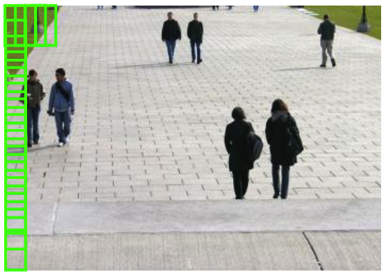

# Week 11

## Problem description and pipline

以 Photo OCR pipeline为例

## Sliding Windows

窗口尺寸可递增来实现大一些行人的识别。

## Getting Lots of Data and Artificial Data

以字体为例，方法：

1. 用不同字体搭配不同背景，生成大量素材
2. 使用已有素材通过字体变形、拉伸等改变外观，形成新的素材。

## Ceiling Analysis: What part of the pipeline to work on Next

通过依次假设流水线上每个模块为「完美」模块，记录每次的系统总体准确度，则相邻两次总体准确度的差异即是对应模块的效率贡献最大值，该值越大，则表示对应模块越值得投入精力去优化。

## Summary

总体学习内容：

