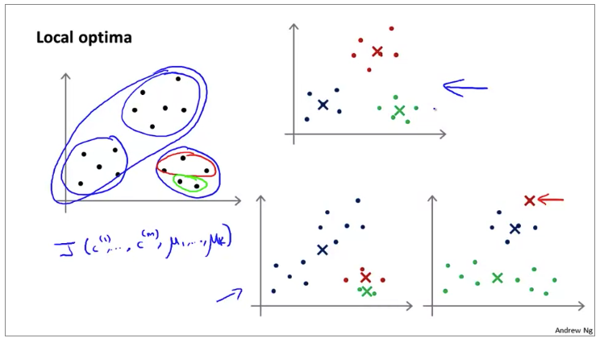
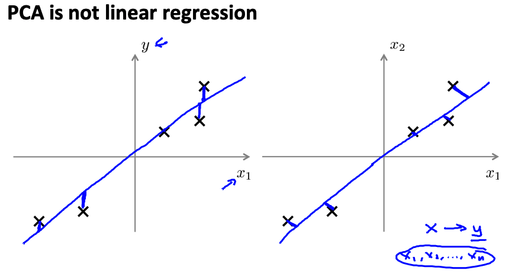
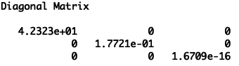

# Week 8 非监督学习

## 聚类算法

## K-means 算法，K均值算法

此算法是迭代算法，迭代时做两件事情：

1. cluster assignment 簇分配

   遍历所有训练数据，找到离它最近的簇心（cluster centroid）

2. 移动聚类中心

   遍历所有簇心，取其训练数据的平均值更新簇心值。

输入：

1. K值，簇的数量；
2. 训练数据集，无y；

## K-means Optimization Objective

定义：

- $c^{(i)}$ = $x^{(i)}$ 所分配进的簇心的索引
- $\mu_k$ = 簇心 $k$， $k \in \mathbb{R}^n$ 
- $\mu_{c^{(i)}}$ = $x^{(i)}$ 所分入的簇心

目标是：最小化$J$，$J(c^{(1)},...,c^{(m)},\mu_1,...\mu_K) = \frac{1}{m} \sum_{i=1}^{m} \|x^{(i)}-\mu_{c^{(i)}}\|^2$，在以下两步中执行。

第一步：cluster assignment step，保持$\mu$ 不变的情况下对每个样本找间距最小的簇心；

第二步：move cluster centroid step，将每个$\mu​更新为与其族下各样本间距最小的位置，即平均值位置。

这里的$J$ 也叫做「失真方程」。

## Clustering - Random initialization

建议：

1. $K \lt m$；
2. 随机取 $K$ 个训练数据作为簇心 $\mu$ 。

如何防止「局部最优」，如下图中右下方的两种情况。

解决办法：多次迭代，例如 100 次，随机选簇心、执行 $K-means$ ，计算 $J$。多次迭代后，从结果中选取一个 $J$ 值最小的。适用于分类数目较小的情况，例如 2、3、4 类。

## Dimensionality Reduction 降维

降维的意义：

1. 压缩数据，节约系统开支
2. 加快学习算法
3. 多维数据降维至2、3D，实现直观的可视化

### Principal Component Analysis （PCA) 主成分分析

-  Reduce from 2-dimensions to 1-dimension: Find a direction (a vector $u^{(1)} \in \mathbb{R}^n$) onto which to project the data so as to minimize the <u>*projection error*</u>.
- Reduce from n-dimensions to k-dimensions: Find $k$ vectors $u^{(1)},u^{(2)},...,u^{(k)}$ onto which to project the data , so as to minimize the projection error.

### PCA 不是线性回归

上图左侧是线性回归，训练数据集有 label ，即 $y$ 。目的是为了在 $y$ 方向上的差异最小，是为了预测某个输入 $x$ 对应的输出值；

右侧的是 PCA，训练数据集没有 $y$ ，目的是 projection error 最小，不是用来做预测的。

### PCA 算法

1. 首先要确保各维度的 $x$ 规模差不多，否则需要先用 feature scaling / mean normalization

2. Reduce data from n-dimensions to k-dimensions:

   1. 计算协方差矩阵：$sigma = \frac{1}{m}\sum_{i=1}^{n}(x^{(i)})(x^{(i)})^T$，向量计算即 $sigma = (1/m)*X'*X$

   2. 计算协方差矩阵的特征向量（eigenvectors）：`[U,S,V] = svd(Sigma);`

      其中的 `U` 即是 n-dimensions 向量，取其中的 1:k 列得到 $U_{reduce}$，即为所需的 k-dimensions

   3. `z = x*Ureduce` ，`z` 就是新的降维之后的数据。

`Xapprox = z*Ureduce` 根据 `z` 逆向计算原始值。

### 如何选择 k ?

通常标准：选定一个 V，例如0.01，则 k 的选择要满足如下条件。
$$
\frac{\frac{1}{m}\sum_{i=1}^{m}\|x^{(i)}-x_{approx}^{(i)}\|^2}{\frac{1}{m}\sum_{i=1}^{m}\|x^{(i)}\|^2} \le V \\
V = 0.01 / 0.05 /0.10/0.15
$$
简便算法：

PCA计算过程中，`[U,S,V] = svd(Sigma);` 这里返回的 S，是一个Diagonal Matrix，例如下图 $n=3$

则 k 的选择可以满足如下条件。
$$
\frac{\sum_{i=1}^{k}S_{ii}}{\sum_{i=1}^nS_{ii}}\ge0.99
$$
这个0.99值的说法是：" 99% of variance retained "