# Week 9 Problem Motivation

## Density Estimation 密度估计

### Anomaly Detection 问题

给定一堆正常的数据分布 $x^{(i)}$，当新的数据 $x$ 出现时，该数据是否是正常的。

做法就是计算概率 $p(x)$ ，并判断：

如果 $p(x)\lt \epsilon$ ，则代表异常，有问题；

如果$p(x)\ge \epsilon$ ，则代表正常，没问题；

### Gaussian Distribution 高斯分布

$$
p(x;\mu,\sigma^2) = \frac{1}{\sqrt{2\pi}*\sigma}exp(-\frac{(x-\mu)^2}{2\sigma^2})
$$

### Parameter estimation

给定一个 dataset，估计出其高斯分布的 $\mu$ 和 $\sigma^2$  .
$$
\mu =\frac{1}{m}\sum_{i=1}^{m}x^{(i)} \\
\sigma^2 = \frac{1}{m}\sum_{i=1}^{m}(x^{(i)}-\mu)^2
$$

### Algorithm

$p(x) = p(x_1)*p(x_2)*...*p(x_j)$
$$
p(x) = \prod_{j=1}^{n}p(x_j;\mu_j,\sigma^2_j)
$$

这就是密度估计问题。

### Anomaly Detection algorithm

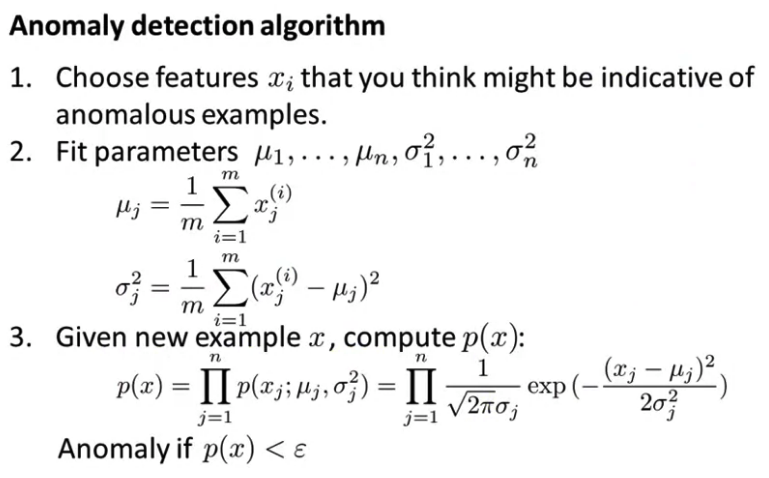

### 如何评价算法？

1. 用正常的无标签数据 $(y=0)$，来训练 $p(x)$ ，求得 $\mu$ 和 $\sigma^2$ . 
2. 用带标签的 CV 数据进行交叉校验
3. 用带标签的 TST 数据进行测试

训练集、CV 集、TST 集的比例，大致是 6:2:2

因为 $y=0$ 的情况远比 $y=1$ 多，所以这种情况是「偏斜」的，因此评价度量可采用 F-1值或计算查准率和召回率。

在 CV 时，可取不同的 $\varepsilon$，取 F-1 值最大的决定 $\varepsilon $。

### 何时使用Anomaly Detection ，何时使用监督学习

| Anomaly Detection                                            | Supervised Learning                                          |
| :----------------------------------------------------------- | :----------------------------------------------------------- |
| 1. 正样本非常少（20个左右），负样本非常多，例如飞机引擎故障，大多数引擎是没有故障的。<br />2. 导致正样本的未知因素不可预测，所以由负样本计算 $p(x)$ 比较适用 | 1. 要求正负样本数量都要很多<br />2. 导致正样本的未知因素将不包括在学习结果中，未来的正样本应该与已知的正样本很像。 |

### 关于 feature 的选择

有时训练数据表现的不像是正态分布，可以将数据转换一下成为新的 feature， 让它分布更像高斯。例如。
$$
newX = log(x) \\ newX = X^{\frac{1}{2}}
$$
如果 $p(x)$ 的正负样本结果都很大（通常表现为 anomaly 样本淹没在 normal 样本中），则可以选择其他 feature 或者根据已有 feature 处理一下生成新的 feature，来让 postive 样本能够突出出来。

### 【选学】 MultiVariate Gaussian Distribution（多元高斯分布）

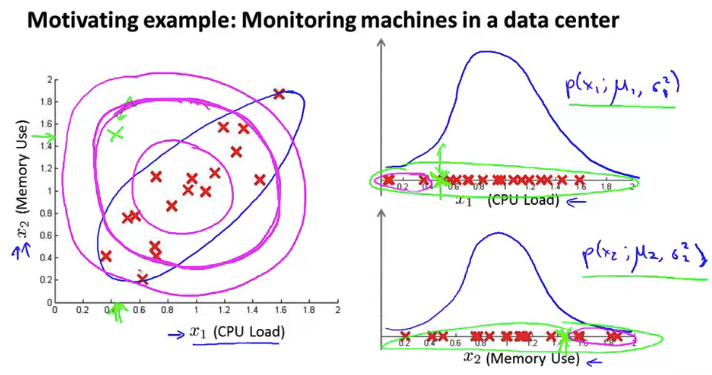

问题：以上图为例，正常样本呈现出一个线性趋势（蓝色圈），但根据 $p(x_1)$ 和 $p(x_2)$ 来判断是否异常的依据是途中粉色的圆圈，所以绿色的异常点在算法中并不会标示为异常点。但实际上，它偏离了正常样本，应当被认为是异常。

MultiVariate Gaussian Distribution 就是将上图的粉线圈变成蓝线圈的形状。

做法：

1.  不单独计算 $p(x_1)$ 和 $p(x_2)$ ，而是整合计算一个模型 $p(x)$ 。

2. $p(x)$ 的参数有：$\mu \in \R^n$ ，$\Sigma \in \R^{n\times n}$ （协方差矩阵，类似PCA中的协方差矩阵。也叫做单位矩阵 identity matrix。）

3. 公式：
   $$
   p(x;\mu,\Sigma) = \frac{1}{(2\pi)^{\frac{n}{2}}|\Sigma|^{\frac{1}{2}}}exp(-\frac{1}{2}(x-\mu)^T\Sigma^{-1}(x-\mu))
   $$
   $|\Sigma|$ 叫做 determinant of $\Sigma$ （$\Sigma$ 的行列式），在 Octave 中命令，```det(Sigma)```

例子：$\mu$ 和 $\Sigma$ 的值会让分布呈现不同的位置和形状。

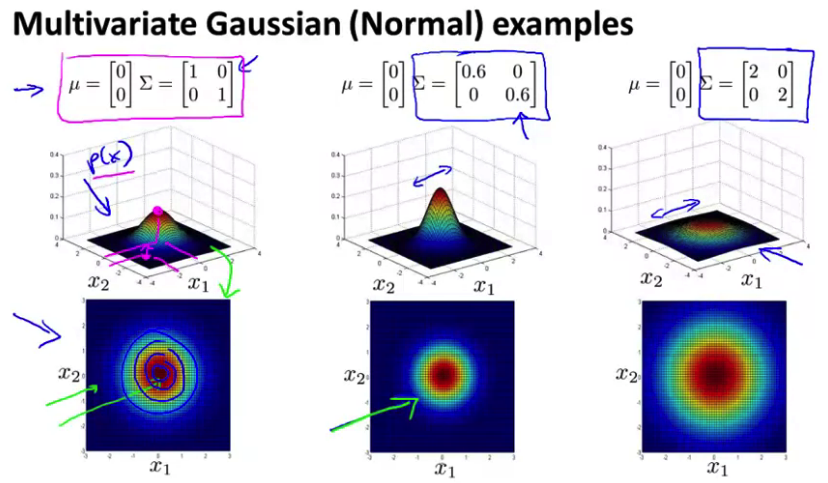

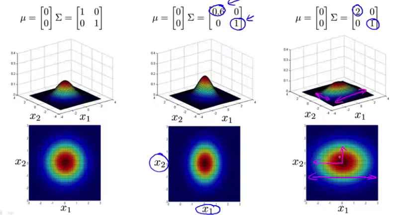

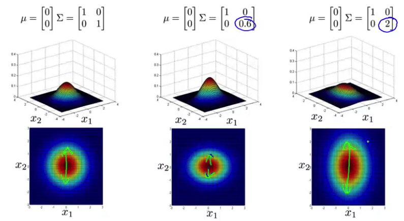

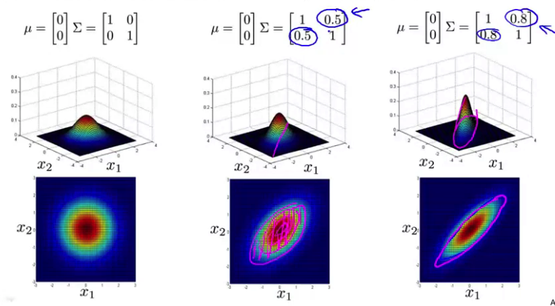

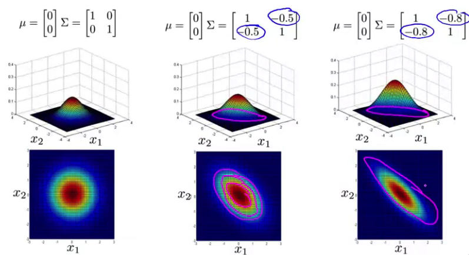

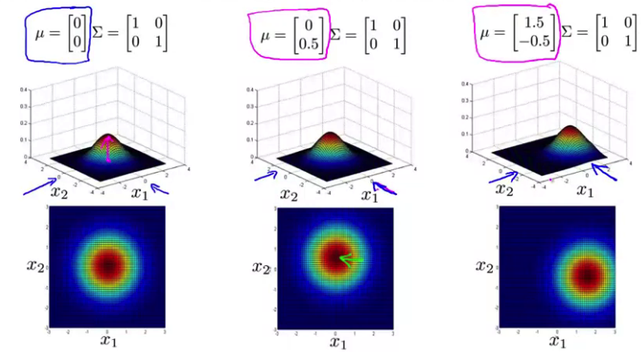

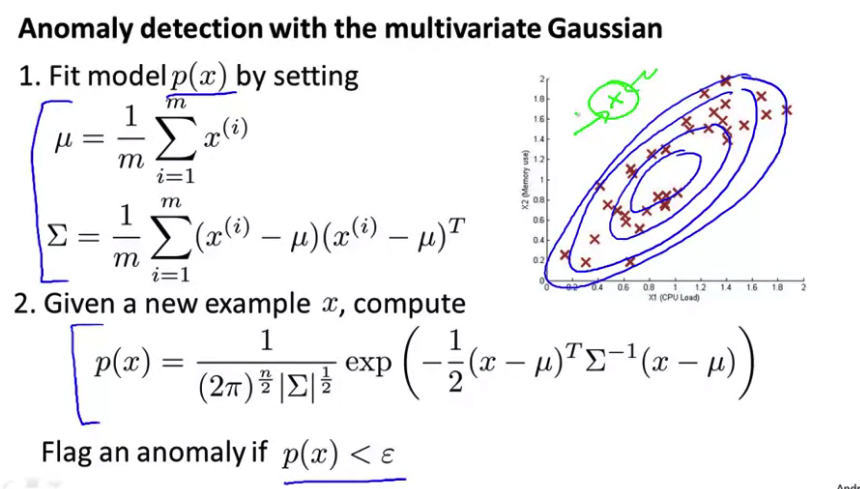

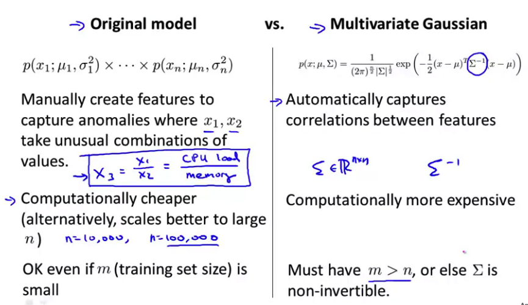

## Predicting Movie Ratings

$n_u$ = no. users
$n_m$ = no. movies
$r(i,j)$ = 1 if user $j$ has rated move $i$
$y^{(i,j)}$ = rating given by user $j$ to movie $i$ (defined only if $r(i,j)$ = 1)

已知用户 $j$ 对一些电影 $i$ 的评分 $y^{(i,j)}$ ，并且已知这些电影的 $n$ 个 features $x^{(i)}$（$x^{(i)}_{n} \in \R^{(n+1)}$，$x_0^{(i)}=1$），通过学习得到用户的喜好 $\theta^{(j)}$ （$\theta^{(j)} \in \R^{(n+1)}$ ），则可以根据 $\theta^{(j)}$ 推断用户对一部已知feature的新电影的评分。一个用户的学习公式如下：
$$
\mathop{min}\limits_{\theta^{(j)}}\frac{1}{2} \sum\limits_{i:r(i,j)=1}\left((\theta^{(j)})^{T}x^{(i)}-y^{(i,j)}\right)^2 + \frac{\lambda}{2}\sum\limits_{k=1}^{n}(\theta_k^{(j)})^2
$$
对 $\theta^{(1)},\theta^{(2),...,\theta^{(n_u)}}$ ,
$$
\mathop{min}\limits_{\theta^{(1)},\theta^{(2),...,\theta^{(n_u)}}} \frac{1}{2}\sum\limits_{j=1}^{n_u}\sum\limits_{i:r(i,j)=1}\left((\theta^{(j)})^{T}x^{(i)}-y^{(i,j)}\right)^2 + \frac{\lambda}{2}\sum\limits_{j=1}^{n_u}\sum\limits_{k=1}^{n}(\theta_k^{(j)})^2
$$
梯度下降更新：
$$
\theta_{k}^{(j)} := \theta_{k}^{(j)} - \alpha\sum\limits_{i:r(i,j)=1}\left( (\theta^{(j)})^Tx^{(i)}-y^{(i,j)} \right)x_{k}^{(j)}  \space (for\space k=0)
\\ \\
\theta_{k}^{(j)} := \theta_{k}^{(j)} - \alpha\sum\limits_{i:r(i,j)=1}\left( (\theta^{(j)})^Tx^{(i)}-y^{(i,j)} \right)x_{k}^{(j)} + \lambda\theta_k^{(j)}  \space (for\space k\neq0)
$$

## Collaborative Filtering

已知用户 $j$ 对一些电影 $i$ 的评分 $y^{(i,j)}$ ，并且已知用户的喜好 $\theta^{(j)}$ （$\theta^{(j)} \in \R^{(n+1)}$ ），则可以根据 $\theta^{(j)}$ 和用户对一部电影的评分来推断电影的属性 $x^{(i)}$。
$$
\mathop{min}\limits_{x^{(i)}}\frac{1}{2} \sum\limits_{j:r(i,j)=1}\left((\theta^{(j)})^{T}x^{(i)}-y^{(i,j)}\right)^2 + \frac{\lambda}{2}\sum\limits_{k=1}^{n}(x_k^{(j)})^2
$$

$$
\mathop{min}\limits_{x^{(1)},x^{(2),...,x^{(n_m)}}} \frac{1}{2}\sum\limits_{i=1}^{n_m}\sum\limits_{j:r(i,j)=1}\left((\theta^{(j)})^{T}x^{(i)}-y^{(i,j)}\right)^2 + \frac{\lambda}{2}\sum\limits_{i=1}^{n_m}\sum\limits_{k=1}^{n}(x_k^{(j)})^2
$$

Collabroative Filtering 指的是 $\theta$ 和 $x$ 之间，已知一方，可推断另一方，二者相互迭代影响。

算法：

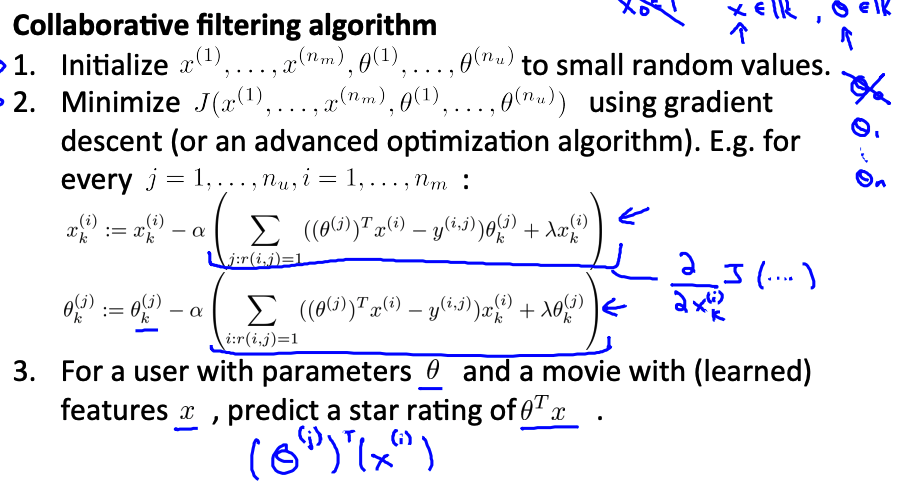

## Low Rank Matrix Factorization

Low Rank Matrix Factorization 就是由 $n$ 个用户的喜好 $(\theta^{(n_u)})^T$ 构成的 $n$ 行矩阵。

How to find movie $j$ related to movie $i$
$$
small \space \|x^{(i)} - x^{(j)}\| \rightarrow movie \space j \space and \space i \space are \space "similar"
$$


## Mean Normalization

缘起，如果某用户对电影都没有评价，那么原推断用户评价的算法将会得出该用户对所有电影评价都为 0 的结论。

这并不合理。因此引入 Mean Normalization 算法。

举例，构建矩阵 $Y$ ，每一列都是一个用户对 5 个电影的 rating，$?$ 为未评价。计算 $\mu$ 为每个电影的平均评分，将 $Y$ 中的评分减去平均分 $\mu$ ，得到新的矩阵，用这个新的矩阵来学习 $\theta^{(j)}$ 和 $x^{(i)}$ 。
$$
Y=\left[
    \begin{array}{ccccc}
      5&5&0&0&?\\
      5&?&?&0&?\\
      ?&4&0&?&?\\
      0&0&5&4&?\\
      0&0&5&0&?\\
    \end{array}
\right], \space 
\mu = \left[
			\begin{array}{c}
			2.5\\
			2.5\\
			2\\
			2.25\\
			1.25\\
			\end{array}
\right] \rightarrow \space 
Y = \left[
    \begin{array}{ccccc}
      2.5&2.5&-2.5&-2.5&?\\
      2.5&?&?&-2.5&?\\
      ?&2&-2&?&?\\
      -2.5&-2.5&2.75&1.75&?\\
      -1.25&-1.25&3.75&-1.25&?\\
    \end{array}
\right]
$$
对于用户 $j$，对电影 $i$ 的评价预测为：
$$
(\theta^{(j)})^Tx^{(i)} + \mu_i
$$
对于第 5 个用户，$\theta^{(5)} = \left[
			\begin{array}{c}
			0\\
			0\\
			\end{array}
\right]$ , $predict = (\theta^{(j)})^Tx^{(i)} + \mu_i$ = $\left[
			\begin{array}{c}
			2.5\\
			2.5\\
			2\\
			2.25\\
			1.25\\
			\end{array}
\right]$